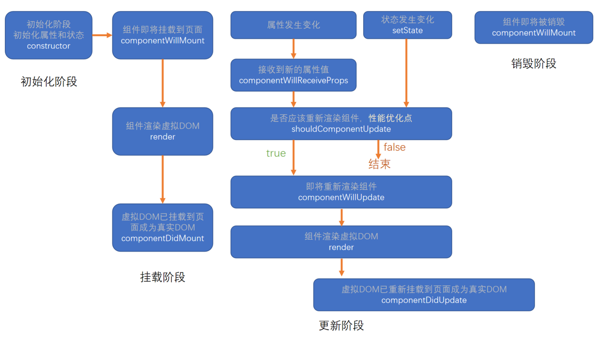
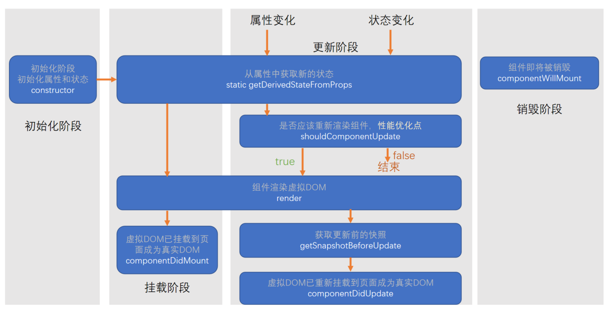

###  生命周期

> -----------

生命周期：组件从诞生到销毁会经历一系列的过程，该过程就叫做生命周期。React在组件的生命周期中提供了一系列的钩子函数（类似于事件），可以让开发者在函数中注入代码，这些代码会在何时的时候运行。

**生命周期仅存在于类组件中，函数组件每次调用都是重新运行函数，旧的组件即将被销毁。**

**旧板生命周期**

React < 16.0.0

> **初始化阶段**

1. constructor 初始化属性和状态
    - 同一个组件对象只会创建一次.
    - 不能在第一次挂载到页面之前,调用setState，为了避免问题，构造函数中严禁使用setState。

> **挂载阶段**

2. componentWillMount 组件即将挂载到页面。
    - 正常情况下，和在构造函数一样，他只会运行一次。
    - 可以使用setState，但是为了避免bug,不允许使用，因此在某些特殊情况下，该函数可能被多次调用。

3. **render** 组件渲染虚拟DOM
    - 返回一个虚拟DOM，会被挂载到虚拟DOM树中，最终渲染到页面的真实DOM中。
    - render可能不只运行一次，只要需要重新渲染，就会重新运行。
    - 严禁使用setState，因为可能会导致无限递归渲染。

4. **componentDidMount** 虚拟DOM已挂载到页面成为真实DOM.
    - 只会执行一次
    - 可以使用setState
    - 通常情况下，会将网络请求，启动计时器等一开始需要操作，书写到该函数中.

> **更新阶段** 组件进入活跃状态

5. componentWillReceiveProps 接收到新的属性值
    - 即将接收新的属性
    - 参数为新的属性对象
    - 该函数可能会导致一些bug，所以不推荐使用

6. **shouldComponentUpdate** 是否应该重新渲染组件，性能优化点
    - 指示React是否要重新渲染该组件，通过返回值true 和 false 来指定 
    - 默认情况下，会直接返回true

7. componentWillUpdate  如果shouldComponentUpdate为true的话，即将重新渲染组件
    - 组件即将被重新渲染

8. render 组件渲染虚拟DOM

9. componentDidUpdate 虚拟DOM已重新挂载到页面成为真实DOM
    - 往往在该函数中使用dom操作，改变元素

10. **componentWillUnmount**  组件即将被销毁
    - 通常在该函数中销毁一些组件依赖的资源，比如计时器



**新版的生命周期**

React >= 16.0.0

1. getDerivedStateFromProps
    - 通过参数可以控制新的属性和状态
    - 该函数是静态的
    - 该函数的返回值会覆盖掉组件状态
    - 该函数几乎是没有用的。

2. getSnapshotBeforeUpdate
    - 真实的DOM构建完成，但还未实际渲染到页面。
    - 在该函数中，通常用于实现一些附加的dom操作。
    - 该函数的返回值，会作为componentDidUpdate的第三个参数。




---------------------------------------
旧版生命周期


```js
import React, { Component } from 'react'
import LiftTest from "./LiftTest.js"
export default class Lift extends Component{
    state = {
        n : 0,
        isShow : true
    }
    //  1. 初始化属性和状态
    constructor(props){
        super(props);
        console.log("constructor", '初始化状态和属性！')
    }

    // 2.组件即将挂载到页面。
    componentWillMount(){
        console.log("componentWillMount","组件即将挂载到页面")
    }

    // 4. 虚拟DOM已挂载到页面成为真实DOM
    componentDidMount(){
        console.log("componentDidMount","组件已经挂载完成！")
        // this.setState((res) =>({
        //     n : res.n + 1
        // }))
    } 

    // 5. 不推荐使用，接收到新的属性值
    componentWillReceiveProps(nextProps) {
        console.log("componentWillReceiveProps", "接收到新的属性值", this.props, nextProps);
    }

    // 6. 是否应该重新渲染组件，性能优化点
    shouldComponentUpdate(nextProps, nextState){
        console.log("shouldComponentUpdate", "是否应该重新渲染", this.props, nextProps, this.state, nextState)
        // if (this.props.n === nextProps.n && this.state.n === nextState.n) {
        //     return false;
        // }
        return true;
    }

    // 7. 即将重新渲染组件
    componentWillUpdate(nextProps, nextState) {
        console.log("componentWillUpdate", "组件即将被重新渲染");
    }
    // 9
    componentDidUpdate(prevProps, prevState) {
        console.log("componentDidUpdate", "组件已完成重新渲染", prevProps, prevState);
    }

    // 10 组件即将被销毁
    componentWillUnmount(){
        console.log("componentWillUnmount","组件被销毁")
    }

    changeN = () => {
        this.setState(res => ({
            n : res.n + 1
        }))
    }
    

    // 3. 组件渲染虚拟dom
    render(){
        console.log("render:", this.state.n)
        var IsShowDom = this.state.isShow ? <LiftTest num={this.state.n}/> : null;
        return  ( <div>
                 <h2>当前数据N：{this.state.n}</h2>
                 <button onClick={this.changeN}>N + 1</button>
                 { IsShowDom }
                 <button onClick={()=>{
                     this.setState({
                         isShow : !this.state.isShow
                     })
                 }}>销毁</button>
            </div>)
    }
}
```


--------------------------------------

**新版**

newlift
```js
import React from "react";
import NewLiftTest from "./NewLiftTest.js";

export default class NewLift extends React.Component{
    state = {
        n : 1,
        isShow : true
    }

    static getDerivedStateFromProps(props, state){
        console.log("getDerivedStateFromProps",props,state)
        return {
            n : state.n
        }
    }

    // 需要和componentDidUpdate一同使用
    getSnapshotBeforeUpdate = (prevProps, prevState) => {
        console.log("getSnapshotBeforeUpdate");
        return 132;
    }
    componentDidUpdate(res,s,r){
        console.log('componentDidUpdate',r)
    }

    render(){
        const res = this.state.isShow ?  <NewLiftTest n={this.state.n} /> : null;
        return (<div>
            {res}
            <p> 
                <span>父级的N { this.state.n }</span>
                <br/>
                <button onClick={()=>{
                    this.setState({
                        n : this.state.n + 1
                    })
                }}>父级组件n + 1</button>
                <button onClick={()=>{
                    this.setState({
                        isShow : !this.state.isShow
                    })
                }}>删除子组件</button>
            </p>
        </div>)
    }
}
```

NewLiftTest
```js
import React from "react";

export default class NewLiftTest extends React.Component{
    state = {
        n : this.props.n
    }
    // 旧版的可以这样问，但是严禁的，因为数据不是单一的了
    componentWillReceiveProps(){
        this.setState({
            n : this.props.n + 1
        })
    }

      // 销毁
    componentWillUnmount(){
        console.log("销毁组件")
    }
    render(){
        return (<div>

            <p> 
                子集的N { this.state.n }
            </p>
            <button onClick={()=>{
                this.setState({
                    n : this.state.n + 1
                })
            }}>子集N + 1</button>
        </div>)
    }
}
```