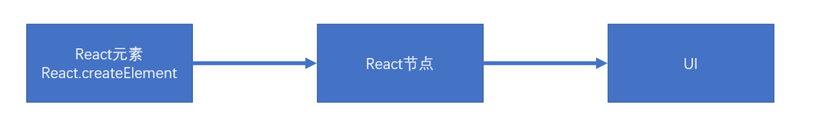
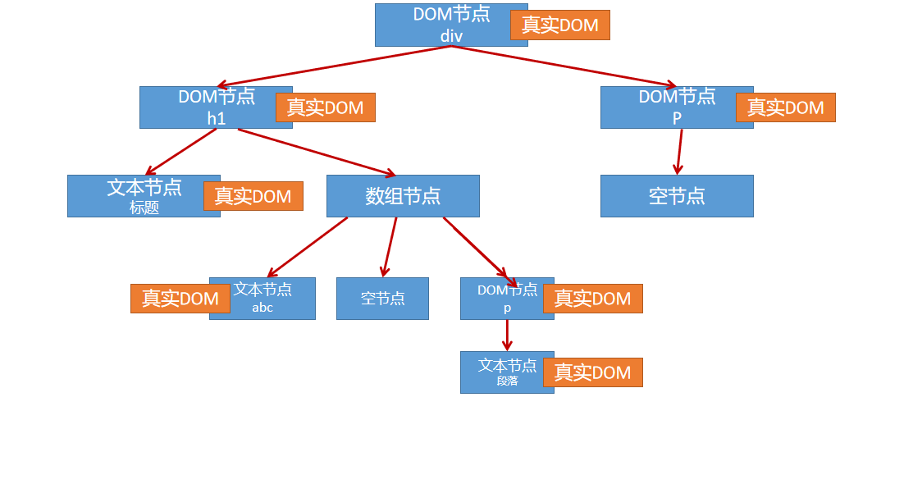
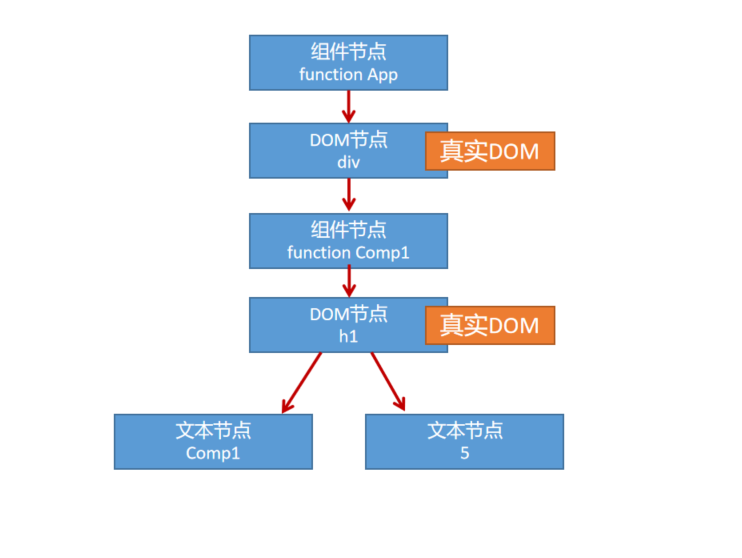

### 渲染原理

渲染：生成用于显示的对象，以及将一些对象形成真实的DOM对象。

- React元素：React Element,通过React.createElement创建（语法糖：JSX）
    
    - 例如：
    - `<div><h1>标题</h1></div>`
    - `<App />`

- React节点：专门用于渲染到UI界面的对象，React会通过React元素创建React节点，ReactDOM一定是通过React节点来进行渲染的。

- 节点类型：
    - React DOM节点：创建该节点的React元素类型是一个字符串。
    - React 组件节点：创建该节点的React元素类型是一个函数或是一个类。
    - React 文本节点：由字符串，数字创建的。
    - React 空节点：由null, undefined, false,true
    - React 数组节点：该节点由一个数组创建。

- 真实DOM：通过document.createElement创建的dom元素。



**首次渲染（新节点渲染）**

1. 通过参数的值创建节点。
2. 根据不同的节点，做不同的事情
    - 文本节点：通过document.createTextNode创建真实的文本节点。

    - 空节点： 什么都不做。

    - 数组节点：遍历数组，将数组每一项递归创建节点（回到第一步进行反复操作，知道遍历结束）

    - DOM节点：通过document.createElement创建真实的DOM对象，然后立即设置该真实DOM元素的各种属性，然后遍历对应React元素的children属性，递归操作（回到第一步进行反复操作，知道遍历结束）

    - 组件节点：
        - 函数组件：调用函数（该函数必须返回一个可以生成节点的内容），将该函数的返回结果递归生成节点（回到第一步进行反复操作，直到遍历结束）

        - 类组件： 
            1. 创建该类的实例。
            2. 立即调用对象的生命周期方法：static getDerivedStateFromProps.
            3. 运行该对象的render方法，拿到节点对象（将该节点递归操作，回到第一步进行反复操作）
            4. 将该组件的componentDidMount加入到执行队列（先进先出），当整个虚拟DOM树全部结构创建完毕，并且将真实的DOM对象加入到容器中后，执行该队列。

3. 生成出虚拟DOM树之后，将该树保存起来，以便后续继续使用

4. 将之前生成的真实的DOM对象，加入到容器中。

```js
const app = <div className="app">
    <h1>
        标题
        {['abc',null,<p>段落</p>]}
    </h1>
    <p>
        {undefined}
    </p>
</div>

console.log(app)

ReactDOM.render(app, document.getElementById('root'))
```

以下代码生成的虚拟DOM树



```js
import React from "react";
import ReactDOM from "react-dom";

function Comp1(props) {
    return <h1>Comp1 {props.n}</h1>
}
function App(){
    return (
        <div>
            <Comp1 n={5}/>
        </div>
    )
}

const app = <App />

console.log(app)

ReactDOM.render(app, document.getElementById('root'))

```

以下代码生成的虚拟DOM树


**更新节点**

更新的场景：
1. 重新调用ReactDOM.render，触发根节点更新
2. 在类组件的实例对象中调用setState,会导致该实例所有的节点更新。

**节点的更新**
- 如果调用的是ReactDOM.render，进入根节点的**对比（diff）更新**
- 如果调用的是setState
    - a. 运行生命周期函数，static getDeivedStateFromProps(从属性中获取状态)
    - b. 运行shouldComponentUpdatae（是否重新渲染组件），如果该函数返回false，终止当前流程。
    - c. 运行render,得到一个新的节点，进入该新的节点的**对比更新**
    - d. 将生命周期函数getSnapshotBeforeUpdate（更新前的快照）加入到执行队列，以待将来执行。
    - e. 将生命周期函数componentDidUpdate（虚拟dom重新挂载到页面成为真实的DOM）加入到执行队列，以待将来执行。

后续步骤
1. 更新虚拟DOM树
2. 完成真实的DOM更新
3. 依次调用执行队列中的componentDidMount
4. 依次调用执行队列中的getSnapshotBeforeUpdate
5. 依次调用执行队列中的componentDidUpdate

**对比更新**
将新产生的节点，对比之前虚拟DOM中的节点，发现异常，完成更新。

问题：对比之前DOM树中的哪个节点？

React为了提高对比效率，做出有以下假设
1. 假设节点不会出现层次的移动(对比时，直接找到旧的数中对应位置的节点进行比较)**所以尽量别改动节点类型和节点结构，为了效率**

2. 不同的节点类型会产生不同的结构
    - 相同的节点类型：节点本身类型相同，如果是由React元素生成，type值还必须一致。
    - 其他的，都属于不同的节点类型。

3. 多个兄弟通过唯一表示（key）来确定对比的新节点

key值的作用：用来通过旧节点，寻找对应的新节点，如果某个旧节点有key值，则其更新是，会寻找相同层级中的相同key值的节点，进行对比。

**如果问key的作用则：key是用来确定节点对比的目标。**

**key值应该在一个范围内唯一（兄弟节点中），并且应该保持稳定**

**找到了对比的目标**

判断节点类型是否一致。

- **一致**

根据不同的节点类型，做不同的事情

**空节点：** 不做任何事情

**DOM节点：** 

1. 直接重用之前的真实DOM对象。
2. 将其属性的变化记录下来，以待将来统一完成更新（现在不会真正的变化）
3. 遍历该新的React元素的子元素，**递归遍历**

**文本节点**
1. 直接重用之前的真实DOM对象。
2. 将新的文本变化记录下来，将来统一完成更新。

**组件节点：**

**函数组件：**重新调用函数，得到一个节点对象，**进行递归比较更新**。

**类组件：**
1. 重用之前的实例。
2. 调用生命周期方法：getDerivedStateFromProps
3. 调用声明周期方法: shouldComponentUpdate，若该方法返回false,终止。
4. 运行render,得到新的节点对象，进行**递归对比更新**。
5. 将该对象的getSnapshotBeforeUpdate加入队列。
6. 将该对象的componentDidUpdate加入到队列。

**数组节点：**遍历数组进行**递归对比更新**

- **不一致**

整体上卸载旧的节点，全新创建新的节点。

**创建新的节点**

进入新节点的挂载流程

**卸载旧节点**

1.  **文本节点，DOM节点，数组节点，空节点，函数组件节点**:直接放弃该节点，如果节点中有子接地那，递归卸载节点

2. **类组件节点**：

- 直接放弃该节点。
- 调用该及诶大的componentWillUnMount（卸载）函数
- 递归卸载子节点

**没有找到对比目标**

新的DOM数中有节点被删除

新的DOM树中有节点添加
- 创建新加入的几点
- 卸载多余的旧节点

`类组件中有实例，函数组件没有实例，要页面中，有节点需要显示隐藏，则需要空节点替换，不然会改变元素树形结构，会卸载后面的元素，重新渲染。尽量别改变节点类型和节点结构。`
